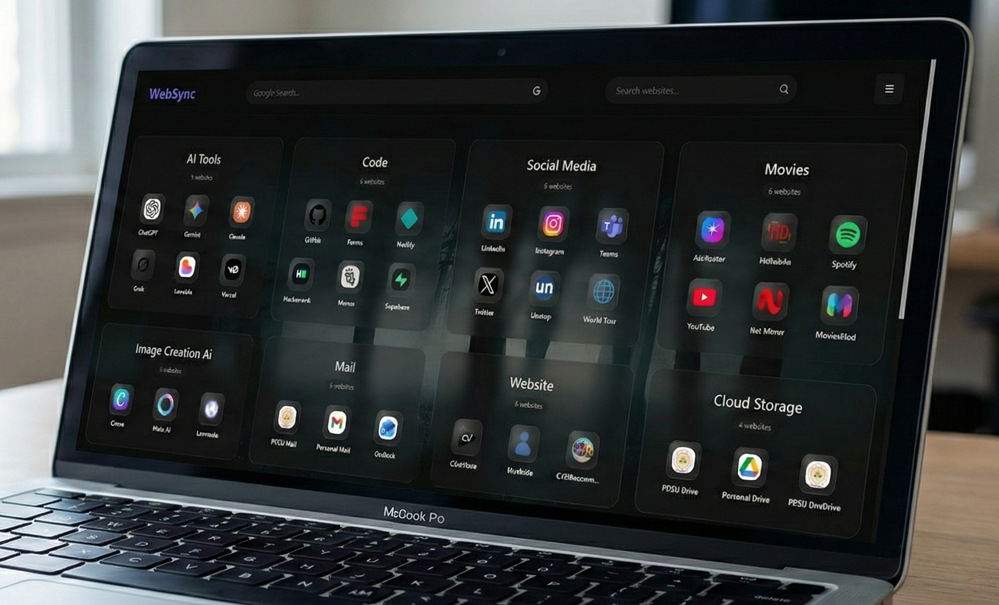

# 👋 Hi there, I'm Patel Priyank

  
  

[📄 View My Resume](https://drive.google.com/file/d/1GfDcQ3nMMY8gyR-s6Y0BJSjpg5sGgb3E/view?usp=sharing) • [🌐 Visit Portfolio](http://priyank.pages.dev/) • [📧 Contact Me](mailto:patelpriyank2526@gmail.com)

---

## 📖 About Me

I am a passionate **Full-Stack Developer** focused on building clean, efficient, and user-centric web applications. My expertise lies in bridging the gap between powerful backends (**Flask/Python**) and modern, responsive frontends (**React/Next.js**).

* 🔭 **Current Project:** Scaling Full-Stack applications with Flask & React.
* 🌱 **Deep Diving:** Mastering **TypeScript** and **Advanced Next.js Architecture**.
* ⚒️ **Workflow:** Leveraging AI (ChatGPT, Claude, Grok) to write cleaner, faster code.
* 💬 **Ask me about:** Python, Flask, Java, and the Modern Web Ecosystem.

---

## 🛠 Tech Stack & Tools

### Languages

  

### Frameworks & Libraries

  

### Databases

  

### Tools & Platforms

  
    
  
  
  
  
  
  

### Data & Visualization

  
  
  
  

---

## 🏆 Featured Projects

<table width="100%">
  <tr>
    <tr>
  <!-- CineVerse Hub -->
  <td width="50%" align="center">
    
     
    <b>CineVerse Hub</b> 
    <i>OTT-style platform to explore, search, and plan movies & series.</i> 
    
    
     
    <a href="https://cineverse-p.netlify.app/">🔗 View Project</a>
  </td>

  <!-- WebSync -->
  <td width="50%" align="center">
    
     
    <b>WebSync</b> 
    <i>Smart bookmark manager with search, categories, and dark mode.</i> 
    
    
     
    <a href="https://patel-priyank-1602.github.io/WebSyncP-/">🔗 View Project</a>
  </td>
</tr>

<tr>
  <!-- Local Network File Transfer -->
  <td width="50%" align="center">
    
     
    <i>Offline, secure file sharing over the same local network.</i> 
    
    
     
    <a href="https://www.linkedin.com/posts/patel-priyank-945131288_pythonproject-localnetwork-tcpsocket-activity-7402354526869061632-P36y/?utm_source=share&utm_medium=member_desktop&rcm=ACoAAEXJSwUBy1pZdakiKqJQHFrTO0xksmyea28">🔗 View Project</a>
  </td>
  <!-- Green Hydrogen InfraVision -->
  <td width="50%" align="center">
    
     
    <i>AI-powered platform for planning green hydrogen infrastructure.</i> 
    
    
     
    <a href="https://www.linkedin.com/posts/patel-priyank-945131288_hackout2025-greenhydrogen-ai-activity-7368260435646517250-9X0C/?utm_source=share&utm_medium=member_desktop&rcm=ACoAAEXJSwUBy1pZdakiKqJQHFrTO0xksmyea28">🔗 View Project</a>
  </td>
</tr>
</table>

---

## 📊 GitHub Analytics

### Profile Summary

  

### Language & Repository Stats

  
  
  

 

---

## 🤝 Let's Connect

  
  
  
  
  

  <i>"Code is like humor. When you have to explain it, it's bad."</i> — <b>Cory House</b>

---

  
  
<b>Developed with ❤️ by Patel Priyank</b>

